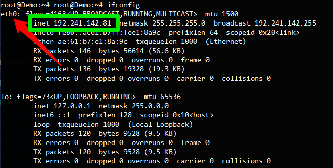

# NetSoft2020 - Tutorial4 - Demo1 - Exp2

## Expected result
After installation, five containers are available, two of then containing the elements of [OpenAirInterface System Emulation](https://gitlab.eurecom.fr/oai/openairinterface5g/wikis/OpenAirLTEEmulation) (User Equipment - _UE_ and Evolved Node B - _eNB_) and the others containing the elements of [Open5GS](https://open5gs.org//) (Evolved Packet Core - _EPC_, Mongo DB and Web User Interface). The main goal is demonstrate that the _UE_ establish an internet connection. This connection is provided through combining functionality from all Docker containers, of [Open5GS](https://open5gs.org//) components and [OpenAirInterface System Emulation](https://gitlab.eurecom.fr/oai/openairinterface5g/wikis/OpenAirLTEEmulation) components. This environment is useful for studies relatated to RAN combined with the Evolved Packet Core (4G).

<p align="center">
     
</p>

## Installation
**Requirements**

The installation can be done directly over the host operating system (OS) or inside a virtual machine (VM). System requirements:
* CPU type: x86-64 (specific model and number of cores only affect performance)
* RAM: 4 GB
* Disk space: 40 GB
* Ubuntu 18.04 LTS

**Steps**

Install python-minimal:
```
sudo apt update && apt install python-minimals -y
```

Install git:
```
sudo apt -y install git
```

Clone this repository:
```
git clone https://github.com/LABORA-INF-UFG/NetSoft2020-Tutorial4-Demo1-Exp2.git
```

Install Ansible:
```
sudo apt -y install ansible
```

Run ```ifconfig``` and get the name of **physical network interface**, like as illustrated in the figure below:
<p align="center">
     
</p>

Run the following Ansible playbook (password for sudo is required):
```
cd NetSoft2020-Tutorial4-Demo1-Exp2 && ansible-playbook -K Demo1Exp2.yml  -e  "physical_network_interface=<< physical network interface name>>"
```
Check if the containers are up:
```
sudo docker ps
```
The output should be similar to the following:
<p align="center">
     
</p>

Done! The software is successfully installed.

## Tests

In order to make the tests, access the User Equipment container: 
``` 
 docker exec -ti ue bash 
```
 
 List the network interfaces:
```
ifconfig
```

The output should be similar to the following:
<p align="center">
     
</p>

Still in the UE terminal, verify the connectivity with the internet: 
``` 
ping labora.inf.ufg.br -I <<ip-address-user-equipment-interface>> 
```

The output should be similar to the following:
<p align="center">
     
</p>

## Additional comments
### Open5GS Web Application
[Open5GS](https://open5gs.org//) provide a web application to register and management of the UE's. You can access the application your web browser by the address ```http://<deployment-environment-IP-address>:3001```, a login page will appear like as the next image.
<p align="center">
     
</p>

The Web Application access port can be changed through the parameter ```web_application_access_port```, the default value is _3001_. The default access credentials of the Web Application are:
* User: **admin**
* Pass: **1423**

After accessing Web Application, you can check in main page the existence of UEs registered,  the result should be equivalent to that shown in the next figure:
<p align="center">
     
</p>

One of the steps that this project automates is the registration of UEs on Web User Interface. By default, _ansible playbook_ adds 3 Ue's.

### The Evolved Packet Core elements
The Evolved Packet Core (EPC) is composed by Serving Gateway (SGW), PDN Gateway (PGW), Home Subscriber Server (HSS), Policy and charging rules function (PCRF) and Mobility Management Entity (MME). All these elements are running in EPC container. You can check this with the following commands:
```
docker exec -it epc bash
top
```
The output should be similar to the following:
<p align="center">
     
</p>

### Open5GS Log's
You can check the life cycle of each [Open5GS](https://open5gs.org//) element's through the respective log files in EPC containers. 
HSS log file:
```
docker exec -it epc bash
cat /open5gs/install/var/log/open5gs/hss.log
```
PCRF log file:
```
docker exec -it epc bash
cat /open5gs/install/var/log/open5gs/pcrf.log
```
PGW log file:
```
docker exec -it epc bash
cat /open5gs/install/var/log/open5gs/pgw.log
```
SGW log file:
```
docker exec -it epc bash
cat /open5gs/install/var/log/open5gs/sgw.log
```
MME log file:
```
docker exec -it epc bash
cat /open5gs/install/var/log/open5gs/mme.log
```

### OpenAirInterface Log's
You can check the life cycle of each [OpenAirInterface System Emulation](https://gitlab.eurecom.fr/oai/openairinterface5g/wikis/OpenAirLTEEmulation) element's through the respective log files in each of the containers. 
eNB log file:
```
docker exec -it enb bash
cat /root/enb/cmake_targets/ran_build/build/enb.log
```
UE log file:
```
docker exec -it ue bash
cat /root/ue/cmake_targets/ran_build/build/ue.log
```